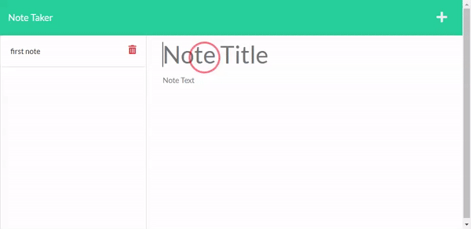

# Note-Taker-Express

## Description 

This project aims to showcase my ability in utilizing the Express.js back end framework to create a note taking application that allows the user to save and delete note data from a JSON file.




## Usage

In order to do this project, I used the `app.post` method of Express.js to handle adding new notes to the JSON database. I also used the `crypto` module to generate random ids for each note saved.


```JavaScript
app.post("/api/notes", (req, res) => {
    //obtain data from request parameter
    const { title, text } = req.body;
    //create new note object with obtained data
    const newNote = {
        id: randomUUID(),
        title: title,
        text: text,
    };
    //add new note object to notes database
    note_db.push(newNote);
    //update json database on local storage
    fs.writeFile("./db/db.json", JSON.stringify(note_db), (err) =>
        err ? console.error(err) : console.log("Success")
    );
    //return updated notes database as response
    res.send(note_db);
});
```

## Links

[Deployed Link](https://note-taker-by-zori.herokuapp.com/)

[Project Repository](https://github.com/zzzorigtbaatar/Note-Taker-Express)

## Credits

* Jerome Chenette, UC Berkeley Extension Coding BootCamp

* https://www.npmjs.com/package/express

## License

[LICENSE](/LICENSE)

## Contact

https://www.linkedin.com/in/zorizulkhuu/

https://github.com/zzzorigtbaatar